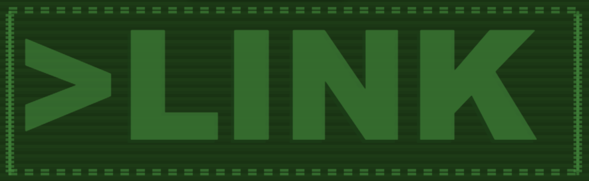

</img>

# What is all this nonsense?!

This is our entry for the 2018 JS13K competition, competing in the
server category.

# About

LINK is a top down bullet-hell inspired multiplayer shooter.

# Controls

<table>
<tr>
<th>Control</th>
<th>Key</td>
</tr>
<tr>
<td>Up</td>
<td>W</td>
</tr>
<tr>
<td>Left</td>
<td>A</td>
</tr>
<tr>
<td>Down</td>
<td>S</td>
</tr>
<tr>
<td>Right</td>
<td>D</td>
</tr>
<tr>
<td>Shoot</td>
<td>Click</td>
</tr>
<tr>
<td>Pickup Weapon</td>
<td>E</td>
</tr>
</table>

# Installation

clone this github repository

` git clone https://github.com/codymikol/link-two `

Make sure yarn is installed on your computer https://yarnpkg.com/en/docs/install#mac-stable

in the root of the project run yarn to install project dependencies

`cd link-two; yarn; `

Now you should be all set up to use the project.

# Running the Project

##### Run Project

` yarn run start `

##### Build / Compress the project

` yarn run build `

##### Test the project

` yarn run test `

# Things to work on

There are plenty of things we have yet to complete and the deadline is
getting closer and closer.
These are some of the things that need to get done before we can ship.
Feel free to mark these off as they get tackled :)

- [ ] SQLite based Map Loader
- [ ] Separate Weapon Types (Start with Pistol, Shotgun, Automatic Rifle)
- [ ] Player Inventory For weapons
- [ ] Weapon Pickups
- [ ] Game Start - Round Iteration - Game End Server Logic
- [ ] Player Rolling / Dodge
- [ ] Waiting For Game Screen
- [ ] Login System with hacky auth
- [ ] Player Death Handling
- [ ] Clientside Health indication
- [ ] Render Held Weapons
- [ ] HUD for reaoad / roll / health status
- [ ] Post Round feedback screen

